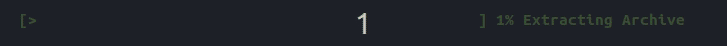
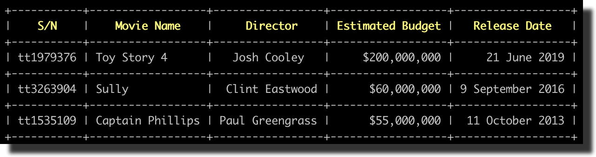

# Adat library
A set of permissive header only libraries to use as third party.


- [Introduction](#introduction)
	+ [What is this library for?](#what-is-this-library-for)
	+ [How to use?](#how-to-use)

- [Included libraries](#included-libraries)
	+ [Fmtlib](#fmtlib)
	+ [Nlohmann-json](#nlohmann-json)
	+ [Plog](#plog)
	+ [Cxxopts](#cxxopts)
	+ [Indicators](#indicators)
	+ [Tabulate](#tabulate)
	+ [Timers-for-benchmark](#timers_for_benchmark)
	+ [Python-string-methods](#python_string_methods)
	
- [Modifications](#modifications)

- [Licenses](#licenses)

# Introduction

## What is this library for?

## How to use?

# Included libraries

## Fmtlib

**{fmt}** is an open-source formatting library for C++. It can be used as a safe and fast alternative to (s)printf and iostreams.

More information can be found on the main github page [https://github.com/fmtlib/fmt](https://github.com/fmtlib/fmt) or their docs page: [https://fmt.dev/7.0.3/](https://fmt.dev/7.0.3/). 

In order to use fmtlib in header file only mode, the user must add```FMT_HEADER_ONLY``` definition:

```
add_definitions(-DFMT_HEADER_ONLY)
```

#### examples:

**Print a container:**

```cpp
std::vector<float> v = {4, 3.55675f, 6.2f};
std::cout << fmt::format("Vector: [{:.2f}]\n", fmt::join(v, ", "));
```

Outputs:

```
Vector: [4.00, 3.56, 6.20]
```

**Print types:**

```cpp
std::cout << fmt::format("float1: {}, float2: {:0.2f}, integer: {:d}, string: {:s}",
                         5.6791f, 5.6791f, 781, "example") << std::endl;
```

Outputs:

```
float1: 5.6791, float2: 5.68, integer: 781, string: example
```

**Print chrono durations**

```cpp
using namespace std::literals::chrono_literals;
fmt::print("Default format: {} {}\n", 42s, 100ms);
fmt::print("strftime-like format: {:%H:%M:%S}\n", 3h + 15min + 30s);
```

Outputs:

```
Default format: 42s 100ms
strftime-like format: 03:15:30
```

## Nlohmann-json

Nlohmann-json Library is a JSON header only library, which focuses on an intuitive syntax, trivial integration and trivial integration. 

More information can be found on the main github page [https://github.com/nlohmann/json](https://github.com/nlohmann/json). 

#### example:

```cpp

json j;

j["pi"] = 3.141;
j["happy"] = true;
j["name"] = "Niels";
j["nothing"] = nullptr;
j["answer"]["everything"] = 42;
j["list"] = { 1, 0, 2 };
j["object"] = { {"currency", "USD"}, {"value", 42.99} };

std::string json_data = j.dump(2);
std::cout << json_data << std::endl;

```

Outputs:

```json
{
  "pi": 3.141,
  "happy": true,
  "name": "Niels",
  "nothing": null,
  "answer": {
    "everything": 42
  },
  "list": [1, 0, 2],
  "object": {
    "currency": "USD",
    "value": 42.99
  }
}
```

## Plog

Plog is a C++ logging library that is designed to be as simple, small and flexible as possible. It is created as an alternative to existing large libraries and provides some unique features as CSV log format and wide string support.

More information can be found on the main github page [https://github.com/SergiusTheBest/plog](https://github.com/SergiusTheBest/plog). 

Here is a minimal hello log sample:

```cpp
#include <plog/Log.h> // Step1: include the headers
#include "plog/Initializers/RollingFileInitializer.h"

int main()
{
    plog::init(plog::debug, "Hello.txt"); // Step2: initialize the logger

    // Step3: write log messages using a special macro
    // There are several log macros, use the macro you liked the most

    PLOGD << "Hello log!"; // short macro
    PLOG_DEBUG << "Hello log!"; // long macro
    PLOG(plog::debug) << "Hello log!"; // function-style macro
    
    // Also you can use LOG_XXX macro but it may clash with other logging libraries
    LOGD << "Hello log!"; // short macro
    LOG_DEBUG << "Hello log!"; // long macro
    LOG(plog::debug) << "Hello log!"; // function-style macro

    return 0;
}
```

Outputs:

```
2015-05-18 23:12:43.921 DEBUG [21428] [main@13] Hello log!
2015-05-18 23:12:43.968 DEBUG [21428] [main@14] Hello log!
2015-05-18 23:12:43.968 DEBUG [21428] [main@15] Hello log!
```

## Cxxopts

This is a lightweight C++ option parser library, supporting the standard GNU style syntax for options.

Options can be given as:

```
--long
--long=argument
--long argument
-a
-ab
-abc argument

```

More information can be found on the main github page [https://github.com/jarro2783/cxxopts](https://github.com/jarro2783/cxxopts). 

#### Example:

Here a simple example of arg parsing function:

```cpp
void parse(int argc, const char** argv)
{
    cxxopts::Options options("simple", "A brief description");

    options.add_options()
        ("b,bar", "Param bar", cxxopts::value<std::string>())
        ("d,debug", "Enable debugging", cxxopts::value<bool>()->default_value("false"))
        ("f,foo", "Param foo", cxxopts::value<int>()->default_value("10"))
        ("h,help", "Print usage")
    ;

    auto result = options.parse(argc, argv);
    if (result.count("help"))
    {
      std::cout << options.help() << std::endl;
      exit(0);
    }
}
```

Outputs:

```
A brief description
Usage:
  simple [OPTION...]

  -b, --bar arg  Param bar
  -d, --debug    Enable debugging
  -f, --foo arg  Param foo (default: 10)
  -h, --help     Print usage
```

## Indicators


Indicators is a header only used to display thread-safe progress bars and spinners.


More information can be found on the main github page [https://github.com/p-ranav/indicators](https://github.com/p-ranav/indicators). 

#### Example:

```cpp
#include <indicators/progress_bar.hpp>
#include <thread>
#include <chrono>

int main() {
  using namespace indicators;
  ProgressBar bar{
    option::BarWidth{50},
    option::Start{"["},
    option::Fill{"="},
    option::Lead{">"},
    option::Remainder{" "},
    option::End{"]"},
    option::PostfixText{"Extracting Archive"},
    option::ForegroundColor{Color::green},
    option::FontStyles{std::vector<FontStyle>{FontStyle::bold}}
  };
  
  // Update bar state
  while (true) {
    bar.tick();
    if (bar.is_completed())
      break;
    std::this_thread::sleep_for(std::chrono::milliseconds(100));
  }

  return 0;
}
```

Outputs:

<p align="center">
    
</p>


## Tabulate

Tabulate is a header-only library to plot command line table in a beautiful way:

Here is an example of of a simple font table printing:

```cpp
#include <tabulate/table.hpp>
using namespace tabulate;

int main() {
  Table movies;
  movies.add_row({"S/N", "Movie Name", "Director", "Estimated Budget", "Release Date"});
  movies.add_row({"tt1979376", "Toy Story 4", "Josh Cooley", "$200,000,000", "21 June 2019"});
  movies.add_row({"tt3263904", "Sully", "Clint Eastwood", "$60,000,000", "9 September 2016"});
  movies.add_row({"tt1535109", "Captain Phillips", "Paul Greengrass", "$55,000,000", " 11 October 2013"});

  // center align 'Director' column
  movies.column(2).format()
    .font_align(FontAlign::center);

  // right align 'Estimated Budget' column
  movies.column(3).format()
    .font_align(FontAlign::right);

  // right align 'Release Date' column
  movies.column(4).format()
    .font_align(FontAlign::right);

  // center-align and color header cells
  for (size_t i = 0; i < 5; ++i) {
    movies[0][i].format()
      .font_color(Color::yellow)
      .font_align(FontAlign::center)
      .font_style({FontStyle::bold});
  }

  std::cout << movies << std::endl;
}
```

Outputs:

<p align="center">
    
</p>

More information can be found on the main github page [https://github.com/p-ranav/tabulate](https://github.com/p-ranav/tabulate). 

## Timers-for-benchmark

Timers-for-benchmark (tsb) is a header only library (developed by us) that allow users to mesure run time for programs with minimum lines of code.

Here are two examples of this library:

#### Examples:

**example 1:**

Simple one timer stopwatch for mesuring run time.

```
tfb::Timer stopwatch("Process x");
std::this_thread::sleep_for(std::chrono::milliseconds(500));
std::cout << stopwatch.get_formated_elapsed_time() << std::endl;
```

Outputs:

```
*** Run time for Process x: 0h 0m 0s 500ms
```

**example 2:**

Multiple timers can be used to benchmark different parts of code. Each timer activation pauses all other timers.

```
tfb::mini_timer read_file("file reading");
tfb::mini_timer process_data("data processing");
tfb::mini_timer save_file("saving to file");
tfb::Multi_timer multi_timer({&read_file, &process_data, &save_file});

for(size_t i = 0; i < 30; i++){
    multi_timer.activate_timer(read_file);
    std::this_thread::sleep_for(std::chrono::milliseconds(50));

    multi_timer.activate_timer(process_data);
    std::this_thread::sleep_for(std::chrono::milliseconds(200));

    multi_timer.activate_timer(save_file);
    std::this_thread::sleep_for(std::chrono::milliseconds(100));

}
multi_timer.pause_current_timer();

std::cout << multi_timer.get_timers_formatted_elapsed_time() << std::endl;
```

Outputs:

```
#-----------------#------------------------------#------------#
|   Clock name    |           Run time           | Percentage |
#-----------------#------------------------------#------------#
| file reading    |             0h  0m  1s 500ms |        14% |
| data processing |             0h  0m  6s   0ms |        57% |
| saving to file  |             0h  0m  3s   0ms |        28% |
#-----------------#------------------------------#------------#
|      Total      |             0h  0m 10s 500ms |       100% |
#-----------------#------------------------------#------------#
```

## Python-string-methods

Python-string-methods (psm) is a header only library (developed by us) that mimic python string methods for ease manipulation of strings. This page [https://www.w3schools.com/python/python_ref_string.asp](https://www.w3schools.com/python/python_ref_string.asp) show the python version of psm library.

Here are some examples:

#### Example:

```cpp
std::string cent = psm::center("center me", 25);
std::cout << "1: [" << cent << "] " << std::endl;

std::vector<std::string> vector = {"foo", "cat", "car"};
std::cout << "2: [" << psm::join(vector, ", ") << "] " << std::endl;

std::array<std::string, 3> array = {"foo", "cat", "car"};
std::cout << "3: [" << psm::join(array, ", ") << "] " << std::endl;

std::string str ("There are two needles in this haystack with needles.");
std::string str2 ("needles.");
std::cout<< "4: ends with = " << psm::endswith(str, str2) << std::endl;

std::cout<< "5: found = " << psm::find(str, str2) << std::endl;

std::string str3 = "There are two needles  in this haystack with needles.";
std::vector<std::string> words = psm::delempty(psm::split(str3, ' '));
std::cout<< "6: [" << psm::join(words, ", ") << "]" << std::endl;
```

Outputs:

```
1: [        center me        ] 
2: [foo, cat, car] 
3: [foo, cat, car] 
4: ends with = 1
5: found = 44
6: [There, are, two, needles, in, this, haystack, with, needles.]
```

# Modifications

# Licenses

| Library                     | Github Page                            | Version | License          |
|-----------------------------|----------------------------------------|---------|------------------|
| fmtlib                      | https://github.com/fmtlib/fmt          | cd4af11 | MIT              |
| Nlohmann-json               | https://github.com/nlohmann/json       | db78ac1 | MIT              |
| plog                        | https://github.com/SergiusTheBest/plog | f4c22b0 | MPL version 2.0. |
| Cxxopts                     | https://github.com/jarro2783/cxxopts   | 302302b | MIT              |
| Indicators                  | https://github.com/p-ranav/indicators  | a776a52 | MIT              |
| Tabulate                    | https://github.com/p-ranav/tabulate    | 56b0b7a | MIT              |
| Timers-for-benchmark (tfb)  | local                                  | _       | BSD-3-Clause     |
| Python-string-methods (psm) | local                                  | _       | BSD-3-Clause     |

